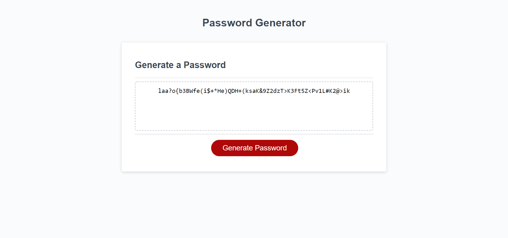

# challenge-03
# Password Generator Starter Code

Challenge-03 is the creation of a password generator using HTML, CSS, and JavaScript

## Deployed Page

The deployed page can be seen by following the [link](https://mike2481.github.io/password-randomizer/)

## Future Usage

This page will serve as a reference for future projects with similar functions

## Contributing

Pull requests are welcome. For major changes, please open an issue first to discuss what you would like to change.

